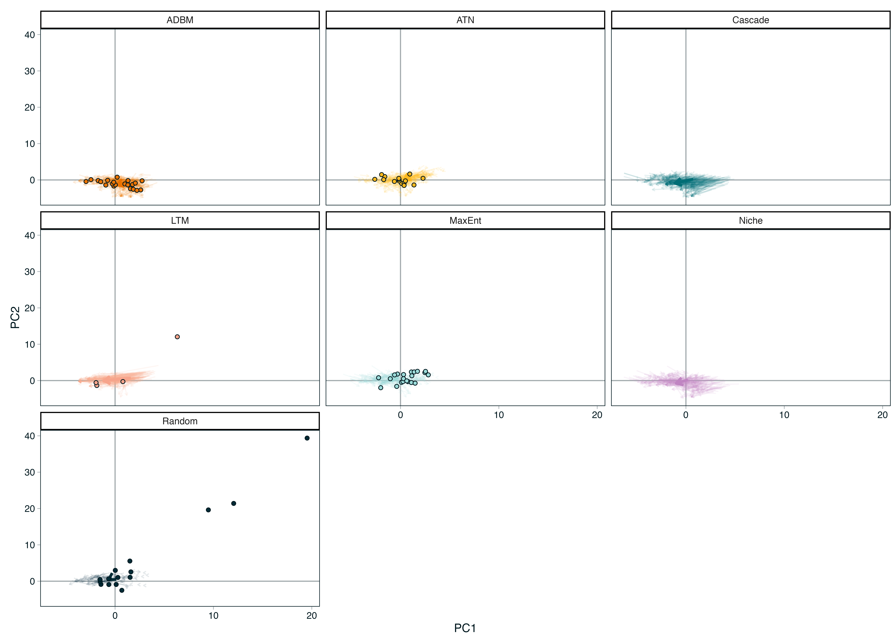
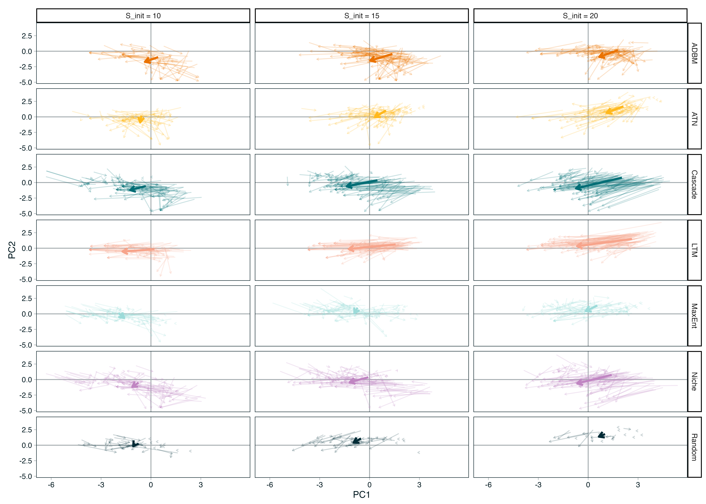
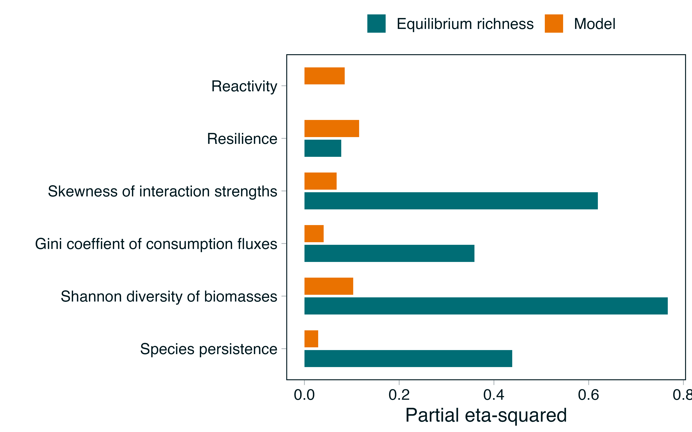
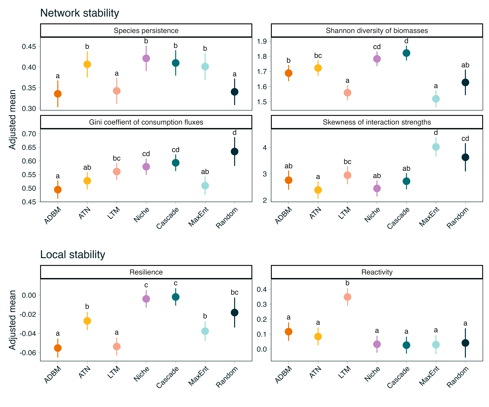

# Introduction

For over two decades, community ecology has relied heavily on static generative models as a means to understand the complexity of empirical trophic networks. At the center of this structural framework is the niche model. Introduced by @williams2000 as a major advancement over the strictly hierarchical cascade model [@cohen1990], the niche model posits that complex food webs can be reproduced by mapping species onto a one-dimensional, continuous niche axis where consumers feed on a contiguous interval of prey. The simplicity of these rules has proven to be remarkably successful, being able to accurate replicate emergent topological properties of empirical networks (such as degree distributions, path lengths, and realistic proportions of trophic guilds [@williams2000]). Consequently, the niche model has established itself as the default baseline for exploring the macro-ecological patterns of ecosystems, evaluating network robustness to primary extinctions, and parameterising Jacobian matrices to probe the boundaries of ecosystem stability [@allesina2012; @curtsdotter2011].

However, this widespread reliance on topological heuristics has obscured a fundamental philosophical divide between structural abstractions and the biological processes that realise real-world networks [@strydom2026]. Traditional structural models operate from the network down, prioritising the statistical distribution of links across a network without explicitly accounting for individual organismal traits or evolutionary constraints. In stark contrast, mechanical frameworks build interaction networks from the node up by determining the presence of links between nodes to build the network. For example, the Allometric Diet Breadth Model (ADBM) implements optimal foraging theory, asserting that a consumer’s realised diet is a deterministic outcome of energy maximization relative to handling times and encounter rates scaled to body mass [@petchey2008]. Similarly, the Allometric Trophic Network (ATN) framework anchors interaction probabilities in consumer-resource body-mass ratios, treating metabolic scaling and physical size limits as the primary limitations of energy flux [@brose2006; @schneider2016]. Occupying a distinct space between these mechanistic and phenomenological perspectives is the Maximum Entropy (MaxEnt) framework [@banville2023]. While MaxEnt remains a structural approach free of explicit biological traits, its philosophical origins lie in statistical mechanics rather than an assumed ecological niche axis. By generating network configurations that maximise informational entropy subject only to macroscopic constraints (such as joint degree distributions), MaxEnt offers a fundamentally different null expectation for network architecture, unburdened by an underlying hierarchical template.

This conceptual divergence raises a critical question for theoretical ecology: Do these distinct structural, statistical, and bioenergetic templates represent interchangeable starting points that ultimately lead to the same conclusions about community dynamics, or does the choice of network construction inherently bias our understanding of ecosystem stability? Recent work has demonstrated that different network construction methods using identical species pools generate vastly different topological signatures and display high interaction (link-based) differences [@strydom2026b]. Because the choice of reconstruction framework influences realised network properties we cannot assume that dynamical predictions are immune to these initial structural assumptions. Indeed, network structure heavily coordinates how biomass is efficiently stored and distributed across trophic levels [@delmas2020]. If the structural template dictates a community's emergent bioenergetic properties (such as its biomass top-heaviness) then the choice of generative model likely carries heavy, unexplored cascading consequences for long-term community dynamics.

If the stability of ecological communities is governed primarily by coarse, systemic constraints on topology, then distinct generative models should yield functionally redundant dynamic behaviors and converge under the selective pressure of competitive exclusion. Conversely, if body-mass distributions and optimal foraging behaviors create unique, non-random structural dependencies that cannot be compressed onto a one-dimensional niche axis, defaulting to the niche model may systematically distort our predictions of community resilience and multi-trophic biodiversity loss. In this study, we systematically isolate the inferential consequences of these structural priors. By embedding networks generated from six distinct modelling philosophies (spanning purely structural, statistical, and trait-driven approaches) within an identical bioenergetic simulation framework, we evaluate whether our foundational models function as benign structural templates or if they fundamentally direct the trajectory of ecological inference.

# Methods

## Network generation

We generated food webs using six established generative models, spanning structural (Niche, Cascade, Random, MaxEnt) and trait-based approaches (Latent Trait Model, Allometric Trophic Network, Allometric Diet Breadth Model). All simulations were implemented in Julia using FoodWebTools and custom extensions.

To isolate model effects from input variation, all trait-based models were parameterised using an identical species pool at each replicate. Species richness was set to range between **XXX**, and for each iteration we sampled (i) a target basal fraction (U(0.1,0.3)), (ii) metabolic classes consistent with this fraction, and (iii) body masses from class-specific log-uniform distributions. These inputs were shared across the Latent Trait, ATN, and ADBM models. Structural models were instead parameterised by a target connectance drawn from U(0.05, 0.3) where relevant.

Networks were generated using a rejection-sampling procedure to enforce comparable emergent properties. A network was retained only if its realised basal fraction and connectance fell within the target ranges (0.1–0.3 and 0.05–0.3, respectively). For trait-based models, networks were accepted only when all three models successfully generated valid networks from the same species pool. We obtained **100** valid replicates per model, with an upper bound on sampling attempts to prevent non-termination. MaxEnt networks were constructed by sampling joint in- and out-degree distributions consistent with a target number of links, followed by entropy-maximising rewiring under degree constraints. For each network, we recorded the adjacency matrix, model identity, input parameters, emergent structural properties, and (where applicable) species traits.

| Model | Type | Main Inputs | Key Assumptions |
|------------------|------------------|------------------|-------------------|
| Niche model [@williams2000] | Structural | Species niche values | Trophic interactions structured by a 1D feeding niche; species consume all prey within a contiguous range; allows cannibalism. |
| Cascade model [@cohen1990] | Structural | Species rank | Consumers feed only on species with lower ranks; strictly hierarchical; no loops or omnivory. |
| MaxEnt model [@banville2023] | Structural | Species richness, connectance | Links assigned to maximize entropy; captures global network properties without species-specific mechanisms. |
| Allometric Diet Breadth Model (ADBM) [@petchey2008] | Realised / Dynamic | Body mass, prey energy content | Consumers maximize energy intake; diet breadth determined by profitability and handling time; allometric scaling governs parameters. |
| Allometric Trophic Network (ATN) [@brose2006] | Realised / Dynamic | Body mass | Interactions constrained by body-mass ratios; mechanical size limits structure networks; probability of interaction follows Ricker function. |
| Latent trait model [@rohr2010] | Realised / Dynamic | Species traits (*e.g.,* body mass) | Interactions inferred statistically based on hidden trait correlations; can incorporate probabilistic constraints on links. |

: Summary of food web models used in this study. Structural models (Niche, Cascade, MaxEnt) generate network topology based on abstract or statistical rules, while realised/dynamic models (ADBM, ATN, Latent trait) incorporate species-specific traits and biological mechanisms to predict interactions. For each model, we list the main inputs and the key assumptions that govern link formation. {#tbl-models}

## Network structure

All networks were converted to directed interaction networks and analysed using a standardised pipeline. We quantified structural properties across multiple scales, including connectance, trophic level, generality, vulnerability, clustering, centrality, trophic coherence, and path length. These metrics were used to characterise the structural signature of each model.

> This could include a table that describes what the metrics 'mean' but maybe we can just lean on the 'usual template', maybe some of the feature selection stuff.

## Dynamic simulations

To evaluate the dynamical consequences of different generative models, we simulated each network using the bio-energetic food web dynamic model implemented in *EcologicalNetworksDynamics.jl* [@lajaaiti2025]. A key feature of the bio-energetic model is the allometric scaling of metabolism, growth and foraging rates with body mass. For trait-based models (ATN, ADBM, LTN), species body masses were taken from the generative networks and rescaled relative to the producer with the lowest body mass. For structural models (Niche, Cascade, MaxEnt, Random), which did not include body mass information, body masses were assigned from species trophic levels assuming apredator–prey body-mass ratio of 100.

For a consumer species $i$, biomass dynamics were determined by gains from feeding, losses to predators, and metabolic maintenance, which is expressed as: $$\frac{dB_i}{dt} = \sum_{j \in \mathrm{prey}(i)}e_{ij} B_i F_{ij} - \sum_{j \in \mathrm{predators}(i)} B_j F_{ji} - x_i B_i$$

where $B_i$ is the biomass of consumer $i$, $e_{ij}$ is its assimilation efficiency when feeding on prey *j*, $x_i$ is its metabolic rate scaled with body mass, and $F_{ij}$ is the functional response of consumer *i* feeding on prey *j*, defined as

$$F_{ij} = \frac{\omega_{i} a_{ij} B_j^{h}} {M_i\left (1 + \displaystyle\sum_{k \in \mathrm{prey}(i)} \omega_{i} a_{ik} h_{ik} B_k^{h} \right)}$$\
where $w_i$ is the equal preference of the consumer i feeding on its prey, $w_i$ = 1/number of prey species. $a_{ij}$ is the attack rate, $h_{ij}$ is the handling time, and $M_i$ is the body mass of consumer *i*. Attack rates and handling times scaled with both consumer and prey body masses. The Hill exponent was set to $h = 2$ as a Type III functional response.

For a basal species $j$, biomass dynamics were determined by its logistic growth and losses to consumers, expressed as:

$$\frac{dB_j}{dt} = r_j G_j B_j - \sum_{i \in \mathrm{predators}(j)} B_i F_{ij}$$ where $r_j$ is the intrinsic growth rate and $G_j = 1 - \frac{B_j}{K_j}$ is the logistic growth modifier , with $K_j$ is the carrying capacity. Both $r_j$ and $K_j$ scaled with species body mass.

All allometric constants used to parametrisse $x_i$, $a_{ij}$, $h_{ij}$, $r_j$, and $K_j$ were set to the default values provided by [@lajaaiti2025].

Each network was simulated until it reached a steady state. Species were considered extinct when their biomass fell below 10−6. At equilibrium, both extinct species and disconnected species were removed, yielding the realised post-simulation network.

## Post-simulation analyses

### Realistic Networks

Something about assessing which networks we generate actually 'look' like we expect a network to look *i.e.,* there is a degree of ecological plausibility. Things to think about - at the network level things like Co, max trophic level and percent basal and st the node level - loops (although maybe not?), isolated species, illogical species.

### Phenotypic trajectory analysis

To quantify how ecological dynamics reshaped network topology, all structural metrics were recalculated following the dynamic simulations using the realised (post-extinction) network. These post-dynamics metrics were compared with those of the initial network using a phenotypic trajectory analysis (PTA) framework \[REF\], where each network was represented as a point in a multivariate topology space defined by the suite of structural network metrics \[TABLE\]. Prior to analysis, all metrics were standardised (mean = 0, SD = 1) to remove differences in scale before constructing a common topology space using principal component analysis (PCA). Both pre- and post-dynamics networks were projected into this shared ordination, allowing each network to be represented by a trajectory from its initial to realised topology.

Trajectory vectors were calculated as the displacement between pre- and post-dynamics positions in the five-dimensional PCA space. Trajectory length was calculated as the Euclidean distance between the two states, providing a measure of the magnitude of topological change. Mean trajectories (centroids) were calculated for each network reconstruction model to summarise their overall direction of change. Pairwise angular differences between trajectory vectors were then calculated using cosine similarity to quantify whether different reconstruction models exhibited similar directions of topological change, independent of the magnitude of displacement. Finally, convergence among network topologies was assessed by calculating each network's Euclidean distance to the global post-dynamics centroid before and after simulation, with positive reductions in distance indicating convergence towards a common realised network topology.

### Community stability

At equilibrium, we calculated two sets of stability metrics to compare realised networks across generative models. First, network-level stability was characterised by species persistence, Shannon diversity of biomasses, the Gini coefficient of consumption fluxes, and the skewness of interspecific interaction strengths. Second, local stability was characterised by resilience and reactivity. Resilience was measured by the real part of the dominant eigenvalue of the Jacobian matrix, with more negative values indicating faster return to equilibrium following a small perturbation [@deruiter1995]. Reactivity quantified the maximum instantaneous amplification of perturbations, with more positive values indicating a stronger tendency for some perturbations to initially move the system further away from equilibrium [@neubert1997].

For each stability metric, we fitted a linear model including food web model and equilibrium species richness as additive predictors:

$\text{Stability metric} \sim \text{Food-web model} + \text{Equilibrium richness}$.

We used Type II ANOVA to assess the contribution of each predictor while controlling for the other. The magnitude of each association was quantified using partial eta-squared, which represents the proportion of effect-plus-residual variation attributable to a predictor after accounting for the other predictor.

## Experimental design

The analysis was designed to isolate the effect of network-generating assumptions by holding constant (i) species richness, (ii) trait distributions (within trait-based models), and (iii) dynamical rules. Differences in structure and dynamics can therefore be attributed directly to the generative model used to reconstruct trophic interactions.

# Results

## Realistic Networks

Need to report the number of networks that fail and 'how' they fail...

{#fig-checks}

{#fig-sankey}

## Networks Converge in Structure

Projection of all networks into a common topology space revealed that initial and realised food-web topologies occupied distinct regions of multivariate space (@fig-PTA). The XX principal components explained **X%** of the total variation in network structure, with variation primarily associated with \[mention the highest loading metrics, e.g. connectance, modularity, trophic coherence, etc.\] (@fig-PTA A). While considerable separation among reconstruction models was evident in the initial topology space, post-dynamics networks exhibited greater overlap, suggesting that ecological dynamics altered structural differences among models.

All reconstruction models underwent measurable shifts in topology following dynamic simulations, although both the magnitude and direction of change differed among models (@fig-PTA B). Centroid trajectories showed that all models moved broadly in the same direction, indicating that ecological dynamics consistently reshaped network topology.

The principal dimensions underlying these changes differed among reconstruction models (@fig-PTA C). For example, **\[Models...\]** exhibited its largest displacement along PC1, whereas **\[Models ...\]** changed primarily along PC3, suggesting that different aspects of network structure were modified depending on the initial reconstruction framework. However given that the models converged to a similar point in multivariate space it suggests that there is a selection for a specific network 'shape' in once a network reaches stability.

Comparison of trajectory vectors demonstrated that most models exhibited small angular differences, indicating that ecological dynamics produced similar directions of topological change across reconstruction methods. Trajectory lengths ranged from **X–Y**, with **\[Model\]** exhibiting the greatest overall restructuring and **\[Model\]** the least.

Finally, realised networks showed evidence of convergence within topology space (@fig-PTA D). The mean Euclidean distance to the global realised-network centroid decreased following dynamic simulations for all models, suggesting that ecological dynamics drove networks towards a common structural endpoint despite differences in initial topology.

![Ecological dynamics reshape food-web topology within a shared multivariate topology space. Network structural metrics were standardised and summarised using principal component analysis, with each network represented by its position before and after dynamic simulations. (A) Principal component loadings showing the contribution of individual network metrics to topology space. (B) Centroid trajectories for each reconstruction model, illustrating the direction and magnitude of topological change between initial and realised networks. (C) Component-wise displacement of model centroids along the first five principal component axes, highlighting the principal dimensions responsible for topological change. (D) Mean Euclidean distance of networks to the overall realised-network centroid before and after simulations, providing a measure of convergence in network topology.](figures/PTA.png){#fig-PTA}

> This is a bonus result

{#fig-failed_pca}

## Network stability inferences

Equilibrium richness explained substantially more variation than generative food web models in network-level stability metrics, with the strongest contribution observed for Shannon diversity of biomasses, followed by the skewness of interaction strengths, species persistence and the Gini coefficient of consumption fluxes (@fig-rel_contribution). In contrast, variation in resilience was influenced by both richness and model, with a larger contribution from model. Reactivity was explained primarily by generative food web models, with very little contribution from equilibrium richness.

{#fig-rel_contribution}

After accounting for equilibrium richness, Niche, Cascade, ATN and MaxEnt generally supported higher species persistence than ADBM, LTM and Random generated food webs (@fig-emmeans). Biomass diversity was highest in Cascade and Niche webs, but comparatively low in LTM and MaxEnt. Random model had the most uneven consumption fluxes, while MaxEnt and Random webs showed the strongest skewness in interaction strengths. ADBM and LTM generated food webs showed the highest resilience, i.e.,fastest asymptotic recovery, whereas LTM food webs were also the most reactive, i.e., strongest initial amplification of perturbations.

{#fig-emmeans}

# Discussion

Reconstruction is Not Neutral (or maybe it is): Discuss how models act as structural priors that condition ecological inference.

Template Dependence: Address the core question: Is everything a derivative of the niche model? If dynamic models show unique cascade patterns not captured by the niche model, argue that the niche template may be insufficient for dynamic questions.

> Important point to bring up here is that the niche and the cascade models are the only models that have no failures - but is this because they create ecologically sound networks or is it because they align better with the internal grammar of the BEFW. IE this is not a test of ecological plausibility but cross model matching. this leads back to the idea that we are mapping the behaviour of models as opposed to any actual ecology

Scale-Dependent Robustness: Reflect on why species-level patterns might look similar across models while the fine-grained story of dynamic change is highly model-contingent.

Implications for Theory: Suggest that researchers must align their reconstruction framework with their inferential goals rather than defaulting to a one-size-fits-all niche template.

# References {.unnumbered}

::: {#refs}
:::