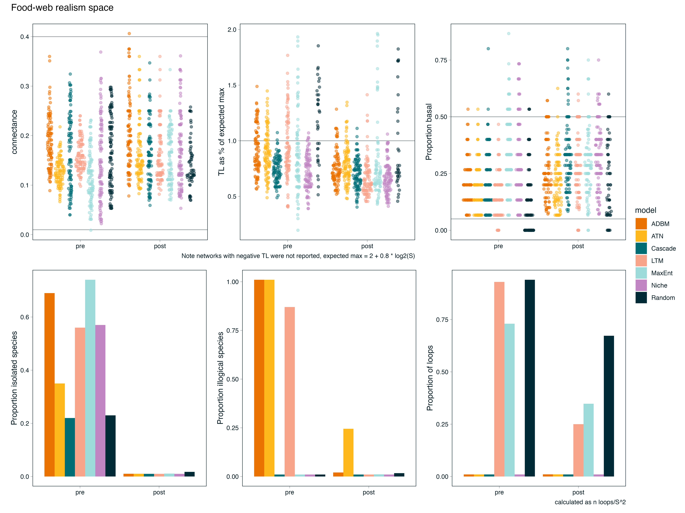
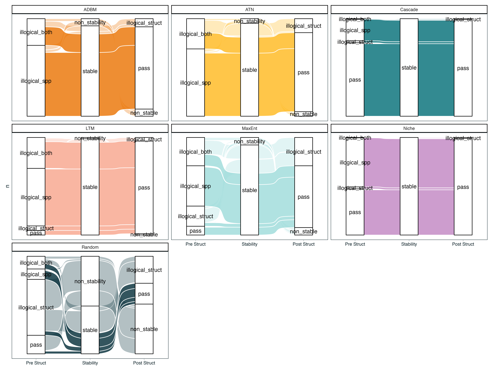

# Introduction

The Niche Model Hegemony: Establish how the Niche Model (and its topological derivatives like the Cascade model) has historically served as the structural prior or template for most network theory.

The Philosophy Gap: Contrast structural/topological models (which prioritise species-agnostic link distributions) with realised/dynamic models like ATN and ADBM (which prioritise biological mechanisms like bioenergetics and optimal foraging). Additionally also including the MaxEnt model which is a structural model but is based on statistical mechanics rather than the niche template.

The Research Question: Do these different philosophical starting points (mechanical vs. statistical) lead to the same conclusions about community stability, or does the choice of template fundamentally bias our understanding of network dynamics?.

# Methods

## Network generation

We generated food webs using six established generative models, spanning structural (Niche, Cascade, Random, MaxEnt) and trait-based approaches (Latent Trait Model, Allometric Trophic Network, Allometric Diet Breadth Model). All simulations were implemented in Julia using FoodWebTools and custom extensions.

To isolate model effects from input variation, all trait-based models were parameterised using an identical species pool at each replicate. Species richness was set to range between **XXX**, and for each iteration we sampled (i) a target basal fraction (U(0.1,0.3)), (ii) metabolic classes consistent with this fraction, and (iii) body masses from class-specific log-uniform distributions. These inputs were shared across the Latent Trait, ATN, and ADBM models. Structural models were instead parameterised by a target connectance drawn from U(0.05, 0.3) where relevant.

Networks were generated using a rejection-sampling procedure to enforce comparable emergent properties. A network was retained only if its realised basal fraction and connectance fell within the target ranges (0.1–0.3 and 0.05–0.3, respectively). For trait-based models, networks were accepted only when all three models successfully generated valid networks from the same species pool. We obtained **100** valid replicates per model, with an upper bound on sampling attempts to prevent non-termination. MaxEnt networks were constructed by sampling joint in- and out-degree distributions consistent with a target number of links, followed by entropy-maximising rewiring under degree constraints. For each network, we recorded the adjacency matrix, model identity, input parameters, emergent structural properties, and (where applicable) species traits.

| Model | Type | Main Inputs | Key Assumptions |
|---------------|---------------|------------------|-------------------------|
| Niche model [@williams2000] | Structural | Species niche values | Trophic interactions structured by a 1D feeding niche; species consume all prey within a contiguous range; allows cannibalism. |
| Cascade model [@cohen1990] | Structural | Species rank | Consumers feed only on species with lower ranks; strictly hierarchical; no loops or omnivory. |
| MaxEnt model [@banville2023] | Structural | Species richness, connectance | Links assigned to maximize entropy; captures global network properties without species-specific mechanisms. |
| Allometric Diet Breadth Model (ADBM) [@petchey2008] | Realised / Dynamic | Body mass, prey energy content | Consumers maximize energy intake; diet breadth determined by profitability and handling time; allometric scaling governs parameters. |
| Allometric Trophic Network (ATN) [@brose2006] | Realised / Dynamic | Body mass | Interactions constrained by body-mass ratios; mechanical size limits structure networks; probability of interaction follows Ricker function. |
| Latent trait model [@rohr2010] | Realised / Dynamic | Species traits (*e.g.,* body mass) | Interactions inferred statistically based on hidden trait correlations; can incorporate probabilistic constraints on links. |

: Summary of food web models used in this study. Structural models (Niche, Cascade, MaxEnt) generate network topology based on abstract or statistical rules, while realised/dynamic models (ADBM, ATN, Latent trait) incorporate species-specific traits and biological mechanisms to predict interactions. For each model, we list the main inputs and the key assumptions that govern link formation. {#tbl-models}

## Network structure

All networks were converted to directed interaction networks and analysed using a standardised pipeline. We quantified structural properties across multiple scales, including connectance, trophic level, generality, vulnerability, clustering, centrality, trophic coherence, and path length. These metrics were used to characterise the structural signature of each model.

> This could include a table that describes what the metrics 'mean' but maybe we can just lean on the 'usual template', maybe some of the feature selection stuff.

## Dynamic simulations

To evaluate the dynamical consequences of different generative models, all networks were subjected to a common bioenergetic simulation framework using EcologicalNetworksDynamics.jl. 

For trait-based models (ATN, ADBM, LTN), species body masses were taken from the generative networks and rescaled relative to the producer with the lowest body mass. These models were then parameterised with their corresponding body masses and standard allometric scaling. For structural models (Niche, Cascade, MaxEnt, Random), where explicit trait information was not available, we assigned body masses using trophic scaling with a predator–prey body-mass ratio of 100, a value commonly used for aquatic food webs. Initial species biomasses were randomly assigned. Dynamics were simulated using a Type III functional response, with a Hill exponent of 2.

Each network was simulated until a steady state was reached, with a minimum simulation time of 2000 time units and a maximum of 5000 time units. Equilibrium properties were calculated over the final 500 time units of each simulation. Species were considered extinct and removed when their biomass fell below 10−6. At equilibrium, both extinct species and disconnected species were removed, yielding the realised post-simulation network.

## Post-simulation analyses

### Realistic Networks

Something about assessing which networks we generate actually 'look' like we expect a network to look *i.e.,* there is a degree of ecological plausibility. Things to think about - at the network level things like Co, max trophic level and percent basal and st the node level - loops (although maybe not?), isolated species, illogical species.

### Phenotypic trajectory analysis

To quantify how ecological dynamics reshaped network topology, all structural metrics were recalculated following the dynamic simulations using the realised (post-extinction) network. These post-dynamics metrics were compared with those of the initial network using a phenotypic trajectory analysis (PTA) framework [REF], where each network was represented as a point in a multivariate topology space defined by the suite of structural network metrics [TABLE]. Prior to analysis, all metrics were standardised (mean = 0, SD = 1) to remove differences in scale before constructing a common topology space using principal component analysis (PCA). Both pre- and post-dynamics networks were projected into this shared ordination, allowing each network to be represented by a trajectory from its initial to realised topology.

Trajectory vectors were calculated as the displacement between pre- and post-dynamics positions in the five-dimensional PCA space. Trajectory length was calculated as the Euclidean distance between the two states, providing a measure of the magnitude of topological change. Mean trajectories (centroids) were calculated for each network reconstruction model to summarise their overall direction of change. Pairwise angular differences between trajectory vectors were then calculated using cosine similarity to quantify whether different reconstruction models exhibited similar directions of topological change, independent of the magnitude of displacement. Finally, convergence among network topologies was assessed by calculating each network's Euclidean distance to the global post-dynamics centroid before and after simulation, with positive reductions in distance indicating convergence towards a common realised network topology.

### Community dynamics

For community dynamics, we focused on persistence (proportion of species surviving), total community biomass, maximum trophic level, diversity (Shannon, evenness), and local stability metrics (resilience and reactivity). Local stability metrics were calculated using EcoNetPostProcessing.jl. Note this allows us to see if we draw the same inferences in network behaviour between models.

## Experimental design

The analysis was designed to isolate the effect of network-generating assumptions by holding constant (i) species richness, (ii) trait distributions (within trait-based models), and (iii) dynamical rules. Differences in structure and dynamics can therefore be attributed directly to the generative model used to reconstruct trophic interactions.

# Results

## Realistic Networks

Need to report the number of networks that fail and 'how' they fail...

{#fig-checks}

{#fig-sankey}

## Networks Converge in Structure

Projection of all networks into a common topology space revealed that initial and realised food-web topologies occupied distinct regions of multivariate space (@figures/PTA.png). The XX principal components explained **X%** of the total variation in network structure, with variation primarily associated with [mention the highest loading metrics, e.g. connectance, modularity, trophic coherence, etc.] (@figures/PTA.png A). While considerable separation among reconstruction models was evident in the initial topology space, post-dynamics networks exhibited greater overlap, suggesting that ecological dynamics altered structural differences among models.

All reconstruction models underwent measurable shifts in topology following dynamic simulations, although both the magnitude and direction of change differed among models (@figures/PTA.png B). Centroid trajectories showed that all models moved broadly in the same direction, indicating that ecological dynamics consistently reshaped network topology.

The principal dimensions underlying these changes differed among reconstruction models (@figures/PTA.png C). For example, **[Models...]** exhibited its largest displacement along PC1, whereas **[Models ...]** changed primarily along PC3, suggesting that different aspects of network structure were modified depending on the initial reconstruction framework. However given that the models converged to a similar point in multivariate space it suggests that there is a selection for a specific network 'shape' in once a network reaches stability.

Comparison of trajectory vectors demonstrated that most models exhibited small angular differences, indicating that ecological dynamics produced similar directions of topological change across reconstruction methods. Trajectory lengths ranged from **X–Y**, with **[Model]** exhibiting the greatest overall restructuring and **[Model]** the least.

Finally, realised networks showed evidence of convergence within topology space (@figures/PTA.png D). The mean Euclidean distance to the global realised-network centroid decreased following dynamic simulations for all models, suggesting that ecological dynamics drove networks towards a common structural endpoint despite differences in initial topology.

![Ecological dynamics reshape food-web topology within a shared multivariate topology space. Network structural metrics were standardised and summarised using principal component analysis, with each network represented by its position before and after dynamic simulations. (A) Principal component loadings showing the contribution of individual network metrics to topology space. (B) Centroid trajectories for each reconstruction model, illustrating the direction and magnitude of topological change between initial and realised networks. (C) Component-wise displacement of model centroids along the first five principal component axes, highlighting the principal dimensions responsible for topological change. (D) Mean Euclidean distance of networks to the overall realised-network centroid before and after simulations, providing a measure of convergence in network topology.](figures/PTA.png){#fig-PTA}

## Inferred network dynamics

# Discussion

Reconstruction is Not Neutral (or maybe it is): Discuss how models act as structural priors that condition ecological inference.

Template Dependence: Address the core question: Is everything a derivative of the niche model? If dynamic models show unique cascade patterns not captured by the niche model, argue that the niche template may be insufficient for dynamic questions.

Scale-Dependent Robustness: Reflect on why species-level patterns might look similar across models while the fine-grained story of dynamic change is highly model-contingent.

Implications for Theory: Suggest that researchers must align their reconstruction framework with their inferential goals rather than defaulting to a one-size-fits-all niche template.

# References {.unnumbered}

::: {#refs}
:::